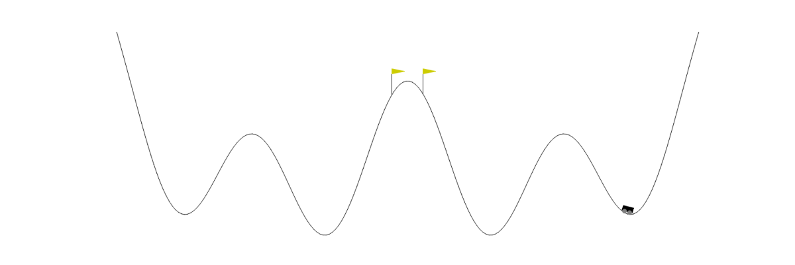

# Umbrella Reinforce: source

Umbrella Reinforce is a **Reinforcement Learning** algorithm inspired by the **Umbrella Sampling** technique, which is popular in computational physics. The algorithm combines ideas from policy gradient RL and classical control. The algorithm is powerful in reducing difficulties of RL problems such as:
- long-delayed reward;
- states-traps;
- lack of the terminal state.

The algorithm is beneficial in application to **custom environment**, since it is **invariant** w.r.t. **discretization time step** and does not require to bother of **episode length** on account of **random states sampling** in contrast to familiar step-by-step simulations.

The algorithm is applied to the Multi-Valley Moutain Car and StandUp problems, which completely represents the described difficulties. 

The algorithm is implemented in the **PyTorch** auto-differentiation package and the authors **encourages to use the source code** of the project  for custom **algorithms modifications** and for **custom problems**. The source code of the environments is **free to use**. It implements an abstract OpenAI **Gym interface** to be easily incorporated into other projects.

See more [here (soon)](http://).


## Usage

1)  Clone the repository.
2)  Install dependeces.
3)  Use `python train.py` to train the neural network.
4)  Use `python simulate.py` to run the policy simulation.
5)  Use `python mvmc_pdf.py` to evaluate agents' distribution in the environment.
6)  Use `python script -h` to see the list of available parameters and default values (replace `script` with `train.py`, `simulate.py` or `pdf.py` script name)

<object data="out/mvmc.pdf" width="700px" height="700px" type='application/pdf'></object>

## Examples


|      Simulation      |                                                                                                                                    Agents Distribution                                                                                                                                     |
|:--------------------:|:------------------------------------------------------------------------------------------------------------------------------------------------------------------------------------------------------------------------------------------------------------------------------------------:|
|  | <object data="out/mvmc.pdf" type="application/pdf" width="700px" height="700px"><embed src="out/mvmc.pdf"><p>This browser does not support PDFs. Please download the PDF to view it: <a href="https://github.com/enuzhin/ur/blob/main/out/mvmc.pdf">Download PDF</a>.</p></embed></object> |


## Dependencies

```
Python 3
PyTorch
NumPy
Gymnasium
Matplotlib
```

## References

- [Umbrella Reinforce Paper (coming soon)](http://arxive.org)
- [Umbrella Sampling (wiki)](https://en.wikipedia.org/wiki/Umbrella_sampling)
- [Reinforcment Learning (wiki)](https://en.wikipedia.org/wiki/Reinforcement_learning)
- [PyTorch](https://pytorch.org)
- [Gymnasium](https://gymnasium.farama.org/)
